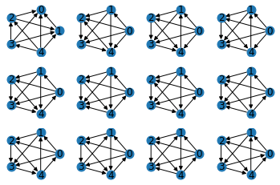

# Tournaments

This short script counts all tournaments on five vertices. There are **twelve**:

[This](https://math.stackexchange.com/questions/2416676/find-the-number-of-different-tournaments-with-5-vertices) stackexchange answer incorrectly claims that there are **ten**.
